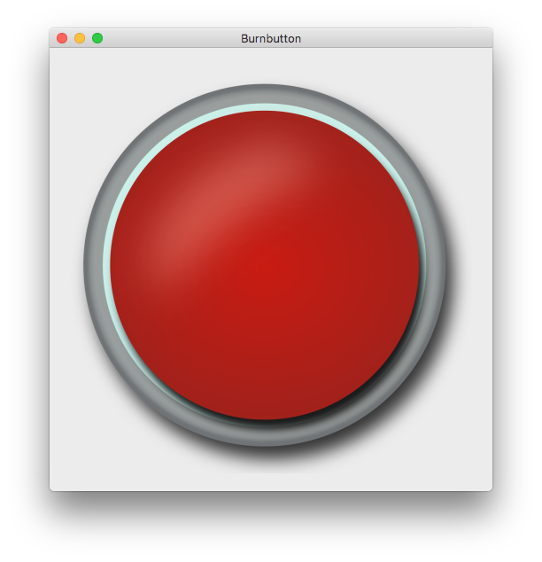

# Burnbutton

A burn button with two sounds (left and right click).

## Prerequisites

* Python 3
* Windows
  * Install NSIS - http://nsis.sourceforge.net
  * Add Python to PATH variable in environment
  * Add NSIS to PATH variable in environment

## Usage

* Start shell
  * Windows
    * Start shell as administrator
    * `Set-ExecutionPolicy Unrestricted -Force`
* Create a virtual environment
  * `python -m venv venv`
* Activate the virtual environment
  * Mac/Linux
    * `source venv/bin/activate`
  * Windows
    * `.\venv\scripts\activate`
* Install the required libraries
  * `pip install -r requirements.txt`
* Run the app
  * `python src/main/python/Main.py`

## Shipping

* Freeze the app (create an executable)
  * `pyinstaller BurnButton.spec`

## Development: macOS

CFLAGS="-I$(brew --prefix openssl)/include -I$(brew --prefix bzip2)/include -I$(brew --prefix readline)/include -I$(xcrun --show-sdk-path)/usr/include" LDFLAGS="-L$(brew --prefix openssl)/lib -L$(brew --prefix readline)/lib -L$(brew --prefix zlib)/lib -L$(brew --prefix bzip2)/lib" env PYTHON_CONFIGURE_OPTS="--enable-framework" pyenv install --patch 3.6.12 < <(curl -sSL https://github.com/python/cpython/commit/8ea6353.patch\?full_index\=1)

/Users/<user>/.pyenv/versions/3.6.12/bin/python -m venv venv

source venv/bin/activate

pip install --upgrade pip

pip install -r requirements.txt

python src/main/python/Main.py

pyinstaller BurnButton.spec

(Initially created .spec file with: pyinstaller --windowed src/main/python/Main.py --noconfirm --name "BurnButton" --icon "src/main/icons/icons.icns")
